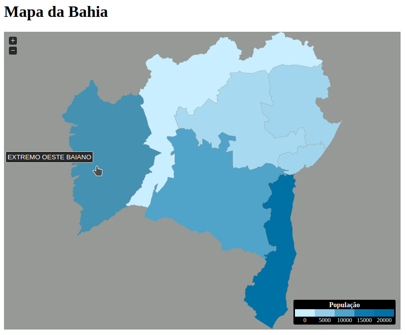
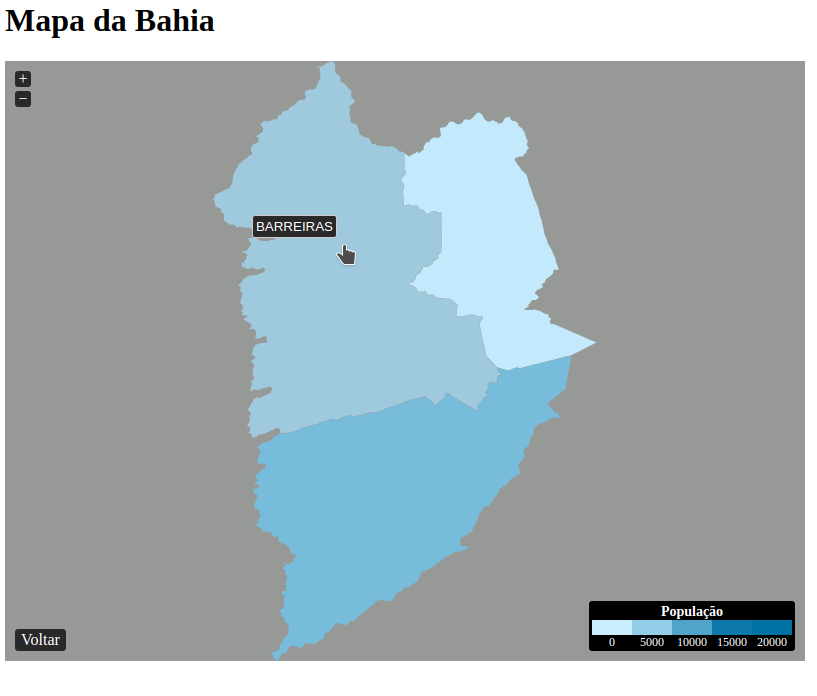

# jvectormap-qgis-mapas
Trabalhando com mapas interativos com JVectorMap, com mapas da Bahia obtido pelo portal do IBGE (shapes files) e modificados com QGIS

https://jvectormap.com  
https://qgis.org/pt_BR/site/  
https://portaldemapas.ibge.gov.br/portal.php#mapa207417

 
Live demo: https://andressandrade.github.io/jvectormap-qgis-mapas/
 

  
  

